```{r xaringan-themer, include = FALSE}
library(xaringanthemer)
library(icons)
mono_light(
  base_color = "midnightblue",
  header_font_google = google_font("Noto Sans"),
  text_font_google   = google_font("Montserrat", "500", "500i"),
  code_font_google   = google_font("Droid Mono"),
  link_color = "#8B1A1A", #firebrick4, "deepskyblue1"
  text_font_size = "28px",
  code_font_size = "26px"
)
```

class: center, middle

# The genome in action

### Detecting and interpreting changes in the 3D genome organization

[bit.ly/3Dgenomics](https://mdozmorov.github.io/Talk_3Dgenome/)

Mikhail Dozmorov, Ph.D.    
Associate professor, Department of Biostatistics  
Virginia Commonwealth University   

<div class="my-footer">
<a href="https://dozmorovlab.github.io/"> `r icons::fontawesome("id-card", style = "solid")` dozmorovlab.github.io</a> | 
<a href="https://github.com/mdozmorov"> `r icons::fontawesome$brands$github` mdozmorov</a> | 
<a href="https://twitter.com/mikhaildozmorov"> `r icons::fontawesome$brands$twitter` @mikhaildozmorov</a>
</div>

---
## Overview

I. Normalization and differential analysis of Hi-C data

- HiCcompare
- multiHiCcompare

<br> &nbsp;

II. Detection and differential analysis of Topologically Associating Domains (TADs)

- SpectralTAD
- TADcompare

<!--
- Predicting the exact location of TAD boundaries
    - preciseTAD
-->
    
---
## The 3D structure of the genome

- Human genome is big - ~3.2 billion base pairs
- ~4 meters (~12ft) of diploid genome is packed into ~10um nucleus
- ~800 trips from Earth to Sun in ~30T cells from the human body

.center[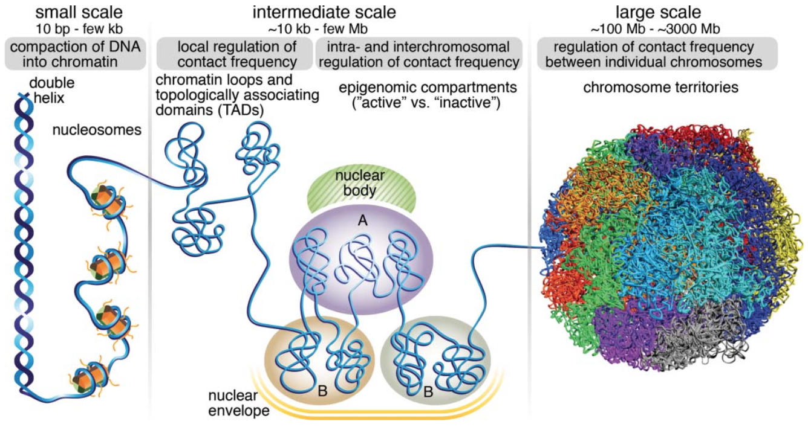]

<div style="font-size: small;"> 

Human body has approximately 30 trillion human cells (excluding trillions of microbiome cells); Stretched haploid genome would be roughly 2 meters - each cell has 4 meters of DNA (1 m = 3.28 ft); 30 trillion * 4 meters = 120 trillion meters; Convert to miles: 120 trillion meters / 1609.34 = 7.45*10^{10}; Convert to Earth-Sun distance: 7.45*10^{10} / 91.43*10^6 = 814.83
</div>

---
##The 3D genome is not static

- The 3D structure of the genome plays a role in many diseases 

- Changes in the 3D genome organization are an ~~emerging~~ established hallmark of cancer

- Disruption of 3D genomic structure can lead to rewiring of enhancer-promoter interactions and changes in gene expression -> disease

---
## Chromatin conformation capture technologies 

.pull-left[
- 3C, 4C, 5C, Hi-C  

- Capture-(Hi)C, ChIA-PET  

- Single-cell variants  

- SPRITE, GAM, ChIA-Drop  

- Specialized (e.g., Methyl-HiC)
]

.pull-right[ 
<br> &nbsp;
 
<br> &nbsp;
]
.small[ Lieberman-Aiden, Erez et al. “[Comprehensive Mapping of Long-Range Interactions Reveals Folding Principles of the Human Genome](https://doi.org/10.1126/science.1181369)” _Science_, October 9, 2009 ]


---
## Hi-C Data as a matrix

.pull-left[
- The genome (chromosome) is split into equally sized regions

- Data is represented by a symmetric matrix of contacts $C_{ij}$ where entry $ij$ corresponds to the number of times region $i$ comes into contact with region $j$

- Off-diagonal data view - increasing **distance** between interacting regions

- Power-law decay of interactions with increasing **distance**
]

.pull-right[
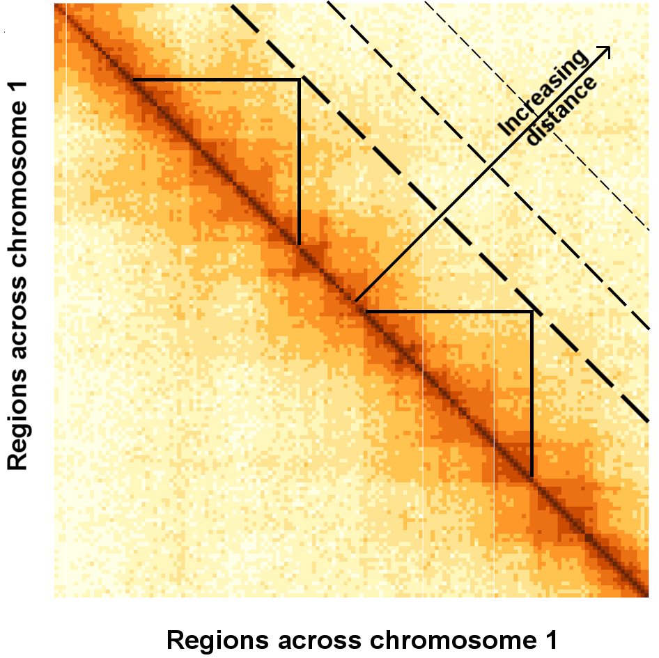
]

---
## Biases in Hi-C data

- Hi-C data suffers from many biases: **sequence-driven** (e.g., mappability, CG content) & **technology-driven** (e.g., type of restriction enzyme, sequencing platform)

- Most normalization methods work only on individual Hi-C dataset, one at a time

- Individual normalization methods do not perform well when the goal is comparison

<!--
.small[Lyu, Hongqiang, Erhu Liu, and Zhifang Wu. “[Comparison of Normalization Methods for Hi-C Data](https://europepmc.org/article/med/31588782).” BioTechniques 68, no. 2 (2020)

Zheng, Ye, Peigen Zhou, and Sündüz Keleş. “[FreeHi-C Spike-in Simulations for Benchmarking Differential Chromatin Interaction Detection](https://doi.org/10.1016/j.ymeth.2020.07.001).” Methods, July 2020]
-->

---
class: center, middle

# HiCcompare

Joint normalization and differential analysis of Hi-C data

---
## Joint Normalization on the MD plot

.pull-left[ 
- **MD plot** represents data from two Hi-C matrices on one plot  

- Similar to the MA plot (Bland-Altman plot)  

- X-axis: **Genomic Distance** (off-diagonal data slices)  

- Y-axis: **Mean differences in interaction frequencies** (log2(IF2/IF1))
]

.pull-right[

]

---
## Loess regression

.pull-left[ 
- Differences between two datasets should be minimal (symmetric around M = 0, Y-axis)

- Local Regression – fit based on local subsets of the data

- Nonlinear, data-driven - creates a smooth curve through the data

- Can use loess fit to correct for bias
]

.pull-right[ 
.center[]
]

---
## Joint Loess Normalization of Hi-C Data

.pull-left[ 
- Differences between two datasets should be minimal (symmetric around M = 0, Y-axis)

- Perform loess regression on the MD plot to calculate $f(D)$ - the predicted interaction frequency $IF$ value at distance $D$
.small[
- $log_2(\hat{IF_{1D}})=log_2(IF_{1D})-f(D)/2$
- $log_2(\hat{IF_{2D}})=log_2(IF_{2D})+f(D)/2$
- Average $IF$ for the pair remains unchanged
]
]

.pull-right[ 
.center[]
]

.small[ Benchmarking study: Lyu, Hongqiang, Erhu Liu, and Zhifang Wu. “[Comparison of Normalization Methods for Hi-C Data](https://doi.org/10.2144/btn-2019-0105)” _BioTechniques_, October 7, 2019
]

---
## Difference detection

.pull-left[ 
- At each distance, take a set of M-values

- Convert M-values to Z-scores $Z_i=\frac{M_i-\hat{M}}{\sigma_M}$

- Z-scores are compared to standard normal distribution to obtain p-values

- FDR multiple testing correction applied on a per-distance basis
]
.pull-right[ 
.center[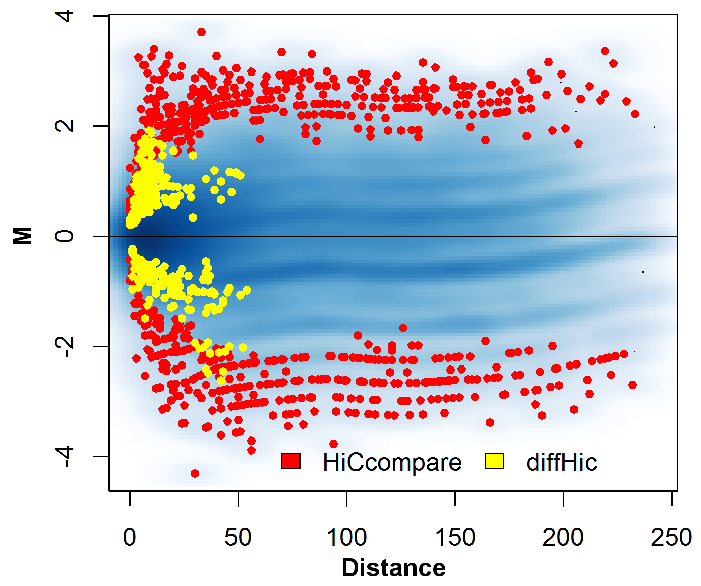]
]

---
## Difference Detection After Different Normalizations

.pull-left[ 
- Simulated 100x100 chromatin interaction matrices with 250 controlled changes applied

- ROC curves for different normalization techniques and fold changes

- Loess provides the most power to detect small fold changes

.small[ https://bioconductor.org/packages/HiCcompare/  

Stansfield, John C., Kellen G. Cresswell, Vladimir I. Vladimirov, and Mikhail G. Dozmorov. “[HiCcompare: An R-Package for Joint Normalization and Comparison of HI-C Datasets](https://doi.org/10.1186/s12859-018-2288-x)” _BMC Bioinformatics_, December 2018 ]
]
.pull-right[ 
.center[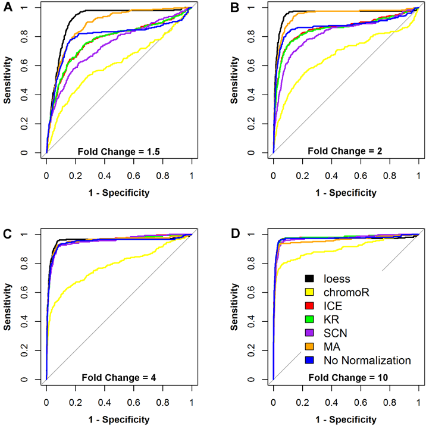]
]


---
class: center, middle

# multiHiCcompare

Normalization and differential analysis of multiple Hi-C datasets

---
## Normalization: Multiple Hi-C datasets

**Cyclic loess** (Ballman et al. 2004) to jointly normalize multiple datasets - take each pair of datasets, normalize, repeat until convergence

1. Choose two out of the N total samples, then generate an MD plot
2. Fit a loess curve $f(D)$ to the MD plot
3. Subtract $f(D)/2$ from the first dataset and add $f(D)/2$ to the second
4. Repeat until all unique pairs have been compared
5. Repeat until convergence

<br> &nbsp; <br> &nbsp; 

.small[Ballman, Karla V., Diane E. Grill, Ann L. Oberg, and Terry M. Therneau. “[Faster Cyclic Loess: Normalizing RNA Arrays via Linear Models](https://doi.org/10.1093/bioinformatics/bth327).” Bioinformatics (Oxford, England) 20, no. 16 (November 1, 2004)]

---
## Differential analysis: Multiple Hi-C datasets

- **Distance-centric analysis** – each off-diagonal data slice has unique statistical properties  

- Split Hi-C data into $d$ distance-centric matrices with $g$ rows (indices for interacting pairs of regions) and $i$ columns (samples)

.center[]

---
## Differential analysis: Multiple Hi-C datasets

- Statistical framework of differential gene expression analysis can be adapted for differential analysis of IFs ([edgeR](https://bioconductor.org/packages/edgeR/) R package)

- **Exact test**

.small[
- For comparing 2 groups without other covariates
- Similar to Fisher's exact test
- Computes exact p-values by summing over all sums of counts that have a probability less than the probability under the null hypothesis
]

- **Generalized Linear Models**

.small[
- For more complex experiments, utilize the GLM framework
- The IF value for a pair of regions $g$ at distance $d$ from sample $i$ follows $NB(M_{di}*p_{dgj},\phi_{dg})$, where $M_{di}$ is the total number of reads in sample $i$ at distance $d$, $p_{dgj}$ is the proportion of interaction counts $g$ in sample $i$ from experimental condition $j$, $\phi_{dg}$ is the dispersion
- The vector of covariates $x_i$ can be linked with $\mu_{dgj}$ through a log-linear model $log(\mu_{dgj}) = x_i^T\beta_{dg} + log(M_{dj})$
]

---
## Analysis overview: Multiple Hi-C datasets

.center[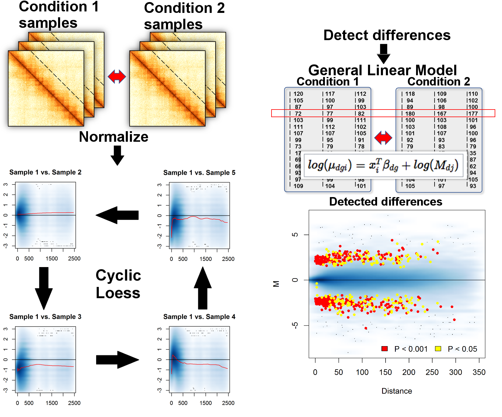]

.small[
Benchmarking study: Zheng, Ye, Peigen Zhou, and Sündüz Keleş. “[FreeHi-C Spike-in Simulations for Benchmarking Differential Chromatin Interaction Detection](https://doi.org/10.1016/j.ymeth.2020.07.001)” _Methods_, July 12, 2020
]

---
## Benchmarking

.center[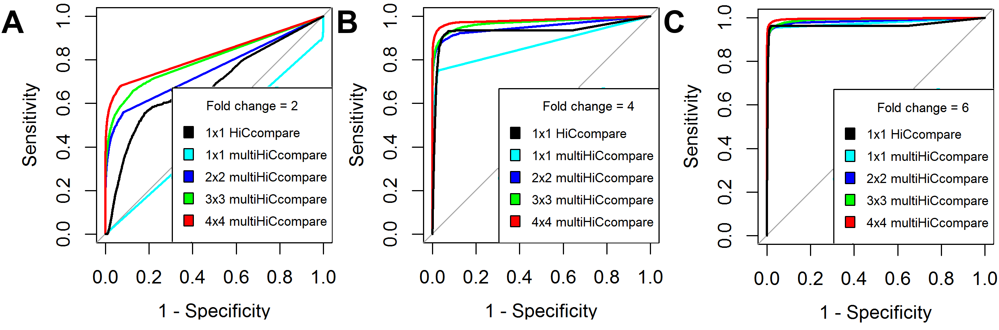]

.small[ https://bioconductor.org/packages/multiHiCcompare/ 

Stansfield, John C, Kellen G Cresswell, and Mikhail G Dozmorov. “[MultiHiCcompare: Joint Normalization and Comparative Analysis of Complex Hi-C Experiments](https://doi.org/10.1093/bioinformatics/btz048).” Bioinformatics, January 22, 2019 ]


<!--
## Benchmarking

.center[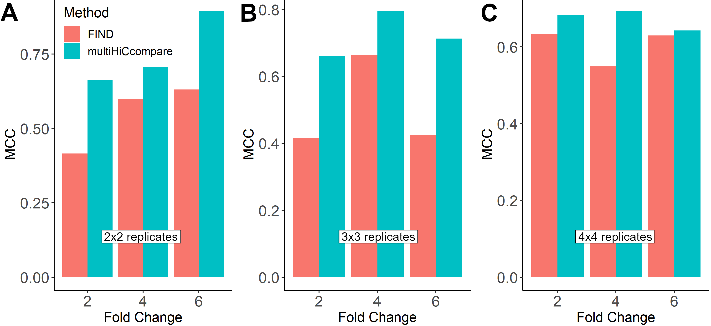]

.small[ https://bioconductor.org/packages/multiHiCcompare/ ]
-->

---
class: center, middle

# SpectralTAD

Detection of Topologically Associating Domains using Spectral Clustering

---
## Topologically Associating Domains

- TADs are 3D structures of frequently interacting regions 
- Boundaries are associated with specific genomic features (CTCF, cohesin, mediator)
- Can be hierarchical (nested, TADs containing sub-TADs)

.center[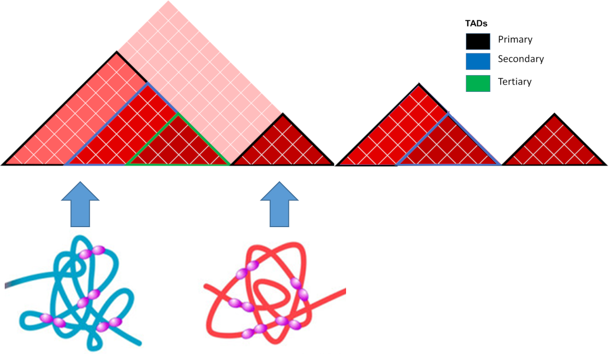]

---
## Why are TADs Important?

- Established early in development

- Highly correlate with replication timing

- TADs create "autonomous gene-domains" partitioning the genome into discrete functional regions

- Disruptions of TADs lead to _de novo_ enhancer-promoter interactions and dysregulation of gene expression -> disease

TADs are a distinct layer of the 3D genome organization

---
## TAD detection using graph theory

.pull-left[ 
- Hi-C data has a natural graph structure, defined by vertices $V$ and edges $E$
    - **Vertices** are genomic regions
    - **Edges** represent interaction strength between any pair of regions

- Vertices and edges are stored in an **adjacency matrix** $A_{ij}$ where $ij$ is the number of edges between a given set of vertices $ij$
]

.pull-right[ .center[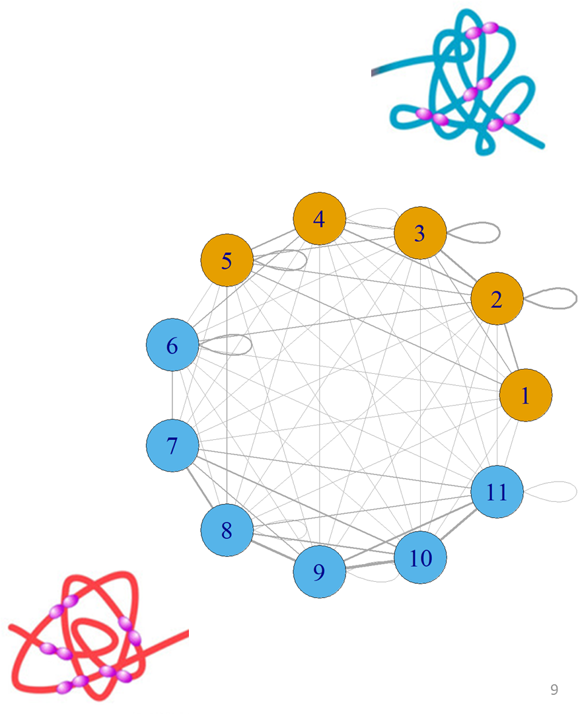] 
<br> &nbsp; <br> &nbsp; <br> &nbsp; <br> &nbsp; <br> &nbsp; &nbsp; <br> ]

---
## Traditional Spectral Clustering

- Specifically designed to cluster graphs

- Works by projecting the data into a lower-dimensional space

- Excels on noisy and non-normally distributed data (Hi-C data)

<!-- Clusters the adjacency matrix $A_{n \times n}$ -->

---
## How to perform spectral clustering

- Calculate the Laplacian:
$$D = diag(A\mathbf{1_n})$$
$$\bar{L} = D^{-\frac{1}{2}}AD^{-\frac{1}{2}}$$
- Calculate the eigenvectors of the Laplacian matrix (graph spectrum):
$$\bar{L}\mathbf{v} = \lambda\mathbf{v}$$
- Normalize the eigenvectors and cluster

---
## Spectral clustering with eigenvector gaps

- Rows and columns of Hi-C matrices are naturally ordered

- TADs are continuous 

- Order points (genomic regions) in eigenvector space, and cluster

- We propose a simple, novel approach to clustering ordered data using gaps between consecutive points in eigenvector space

---
## Step 1: Plot the non-normalized eigenvectors

.center[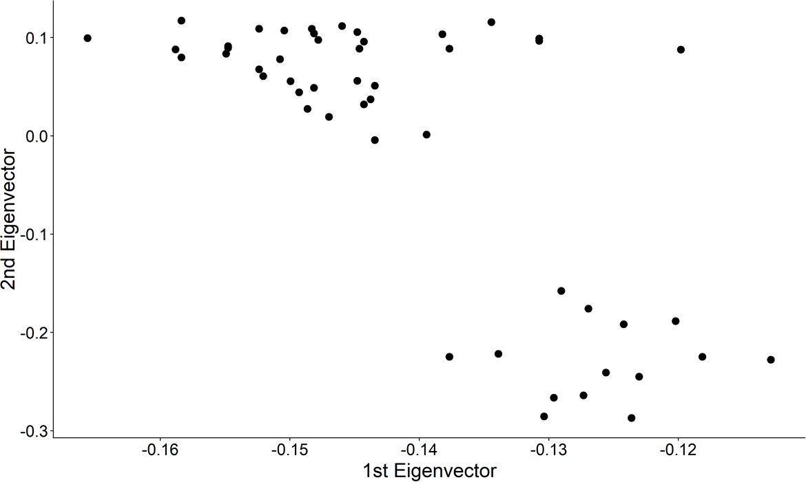]

---
## Step 2: Project on to Unit Circle
 
.center[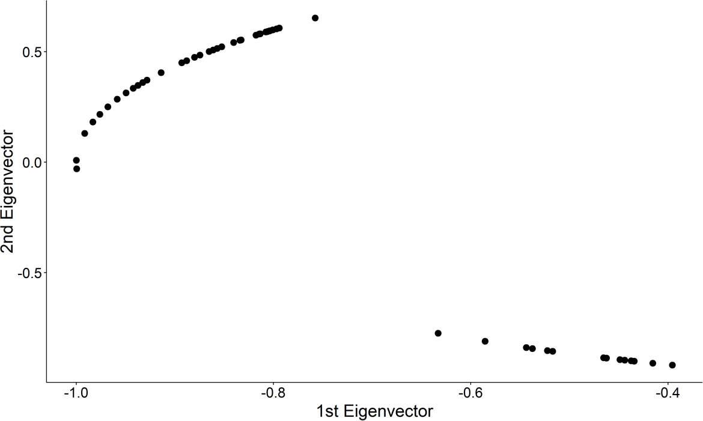]

---
## Step 3: Find the k-largest gaps and partition

.center[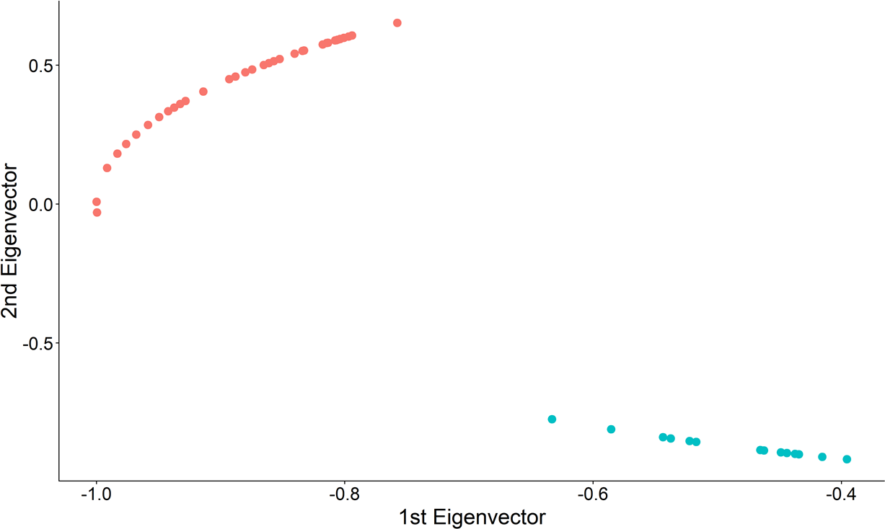]

---
## Step 3: Find the k-largest gaps and partition

.center[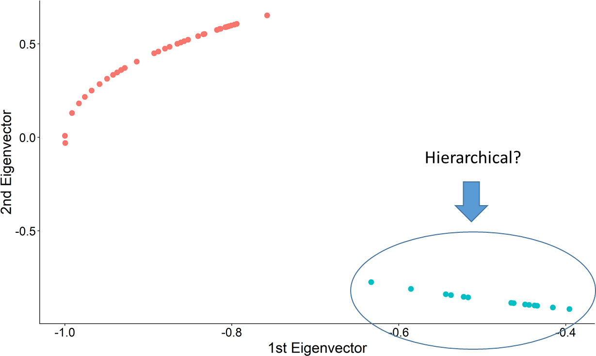]

<!--
## Silhouette Score

- A strong TAD should have a high level of interactions within the TAD and a low level of interactions between the TAD
- This can be quantified using silhouette score:

$$s(i) = \frac{b(i)-a(i)} {max(a(i), b(i))}$$

$b(i)$ is the mean distance between point $i$ and all values in its cluster, and $a(i)$ is the mean distance between point $i$ all values outside of its cluster

- Here, we define distance between two points $i$ and $j$ as $\frac{1}{1+C_{ij}}$
-->

---
## Windowed Spectral Clustering

- We know the biologically maximum TAD size (2 million bp)

- We can use a 2 million bp sliding window to perform spectral clustering and aggregate

- Advantages of the sliding window
  - Reduced cubic complexity of spectral clustering $O(n^{3})$ to linear complexity $O(n)$
  - Naturally discards noisy interactions at large genomic distances

---
## SpectralTAD algorithm
 
1. Cut a window from the matrix equal to the maximum TAD size (2Mb)
2. Find the graph spectrum of the window and calculate eigenvector gaps
<!--3. Find $n$-largest gap values-->
3. Find a set of clusters that maximize the silhouette score
4. Slide the window to the next group of loci and repeat

.center[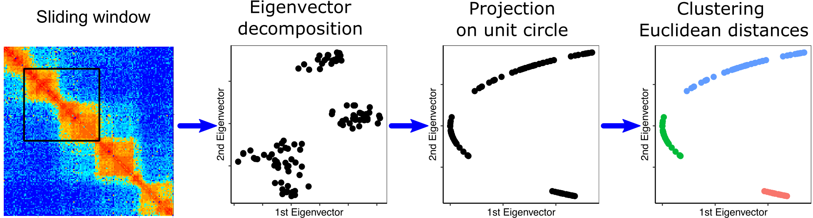]

---
## Determining a hierarchy of TADs

- TADs are hierarchical in nature (organized into large meta-TADs with sub-TADs within them)

- To find sub-TADs, we use a novel metric called boundary score

- **Boundary score** is just the z-score for each eigenvector gap (Euclidean distance between adjacent points)

.center[]

---
## Boundary score as a metric for TAD boundary detection

.center[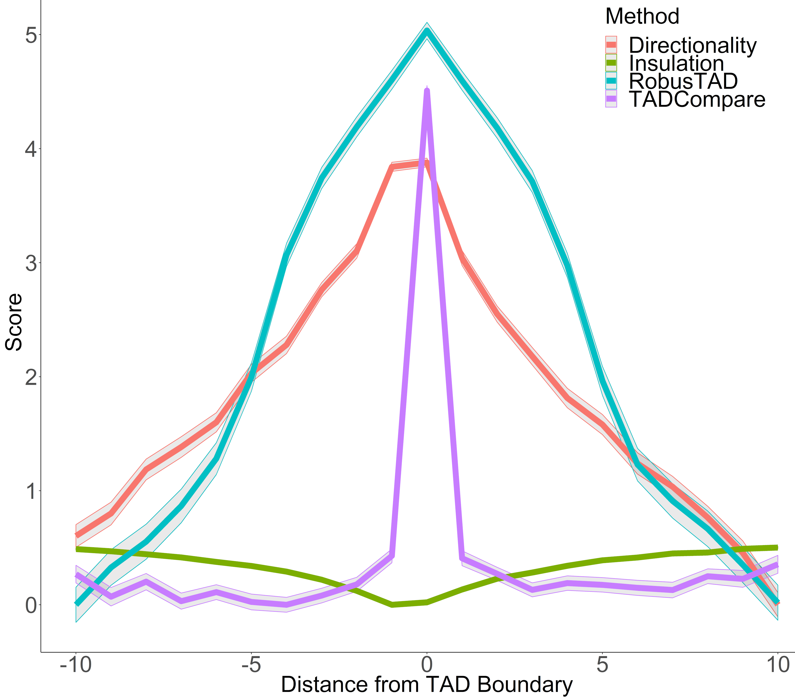]

---
## Determining a hierarchy of TADs

For each initial TAD:

- Perform spectral clustering on the submatrix defined by the initial TAD

- Calculate the eigenvector gaps for each consecutive pair of regions

- Convert eigenvector gaps to boundary scores

- If any boundary score is greater than 1.96, this is a sub-TAD boundary

- Repeat for all sub-TADs until no z-score is greater than 1.96

---
## TAD Calling: SpectralTAD

- We compared SpectralTAD against four TAD callers:
  - TopDom
  - HiCSeg
  - OnTAD
  - rGMAP

- Good TAD caller must satisfy three criteria:
  - Be robust to Hi-C data imperfections (resolution, sparsity, sequencing depth)
  - Detect biologically significant, hierarchical TAD boundaries
  - Be fast

---
## SpectralTAD is robust to resolution

.center[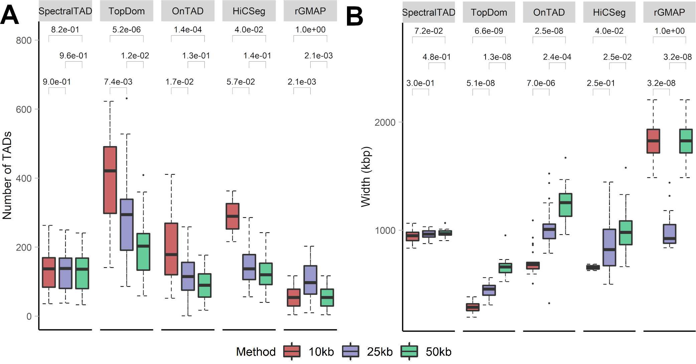]

---
## SpectralTAD is robust to sparsity

- 25 simulated matrices with pre-defined TADs (HiCToolsCompare)
- The percentage of the matrix replaced with zeros
- Jaccard similarity between the detected and pre-defined TADs

.center[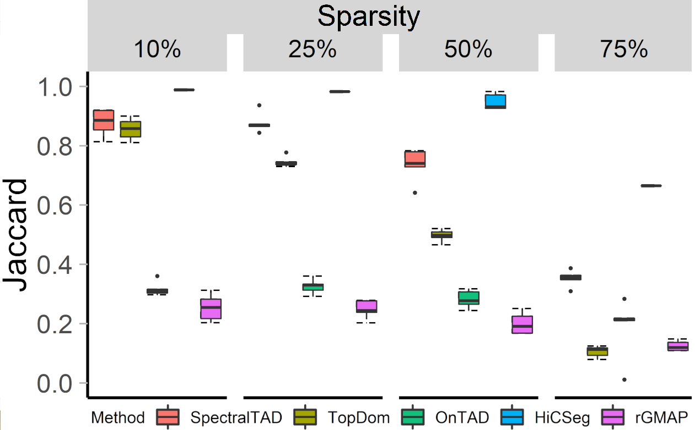]

---
## SpectralTAD is robust to sequencing depth

- Downsample matrices uniformly at random
- Measure Jaccard similarity between TADs detected from the original and sparse data

.center[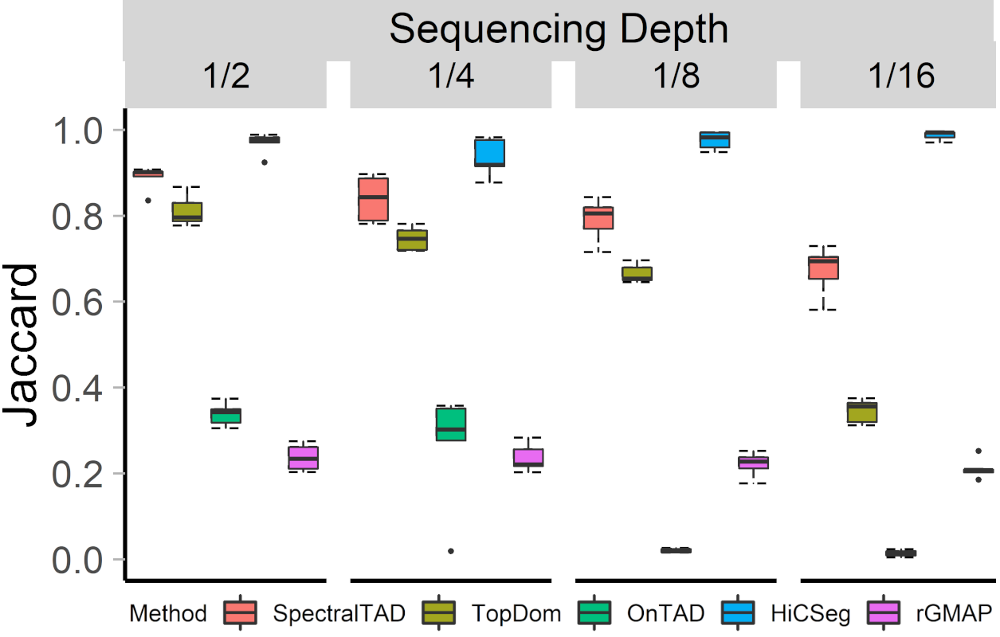]

---
## Hierarchical TAD boundaries differ

- Boundaries shared by two TADs (Level 2) or three TADs (Level 3) are more biologically significant

.center[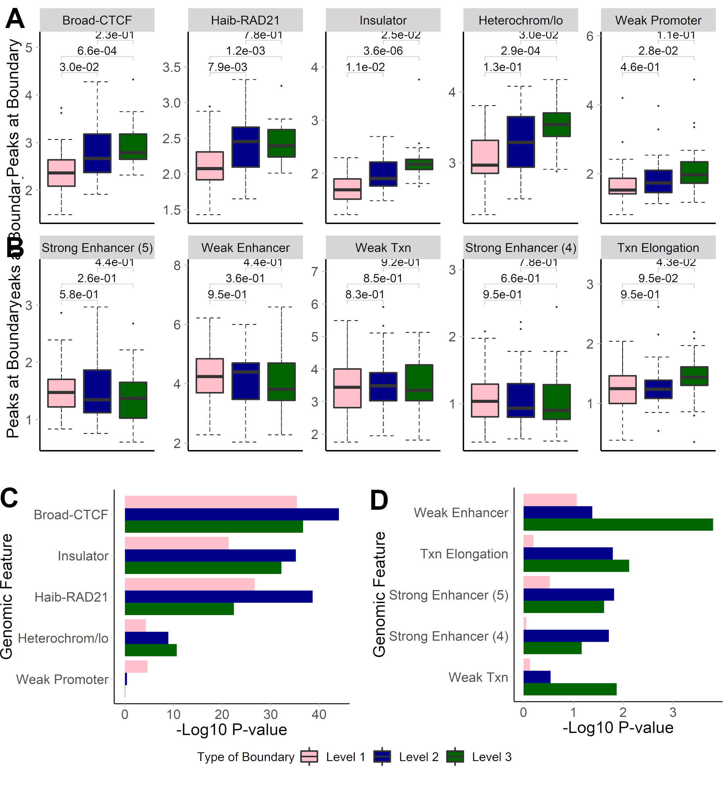]

---
## SpectralTAD is fast
 
A) Runtimes for various TAD callers at different chromosome sizes
B) Runtimes for various TAD callers across all chromosomes (25kb data)

.center[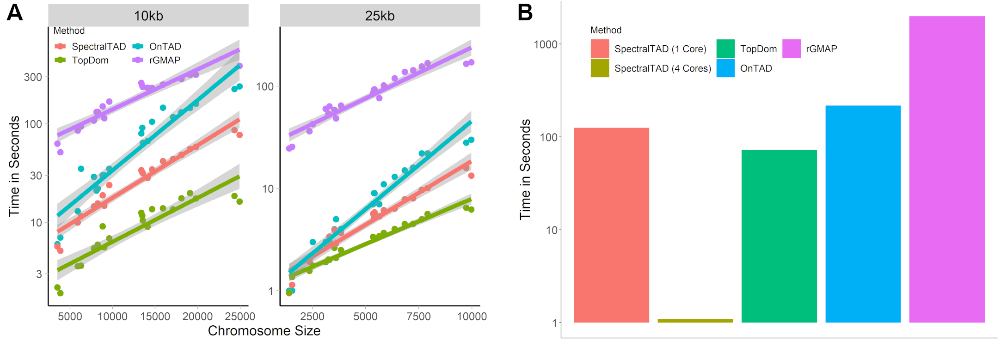]

---
## SpectralTAD Package

- **Input**: three types of contact matrices ( $n \times n$, sparse and $n \times (n+3)$) in text format, import from `.hic` and `.cool` files supported

- Two main functions: `SpectralTAD` and `SpectralTAD_Par` (parallelized)

- **Output**: A 3-column BED file for each hierarchy level

- Visualization options include output for `Juicebox`

<br> &nbsp; <br> &nbsp; 

.small[ https://bioconductor.org/packages/SpectralTAD/

Cresswell, Kellen G., John C. Stansfield, and Mikhail G. Dozmorov. “[SpectralTAD: An R Package for Defining a Hierarchy of Topologically Associated Domains Using Spectral Clustering](https://doi.org/10.1186/s12859-020-03652-w)” _BMC Bioinformatics_, July 20, 2020
 ]

---
class: center, middle

# TADcompare

Differential and time course analysis of TAD boundaries

---
## Comparing TADs (TADcompare)

.pull-left[ 
- Boundary score can be compared across conditions – differential boundary score  

.center[]
 ]

.pull-right[ .center[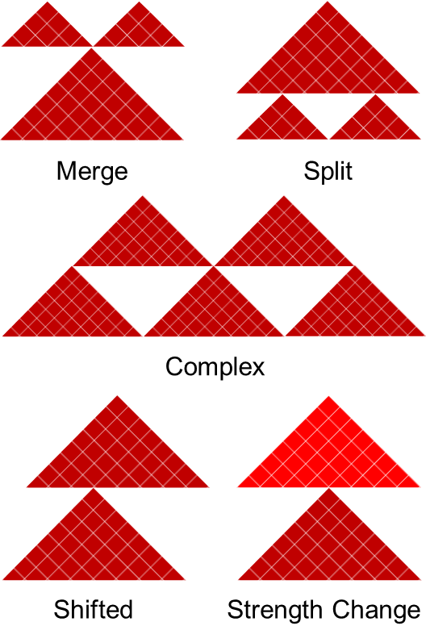] ]

.small[ Cresswell, Kellen G., and Mikhail G. Dozmorov. “[TADCompare: An R Package for Differential and Temporal Analysis of Topologically Associated Domains](https://doi.org/10.3389/fgene.2020.00158)” _Frontiers in Genetics_, March 10, 2020 ]

---
## Complex TAD boundary changes are frequent between biological replicates and cell/tissue types

.center[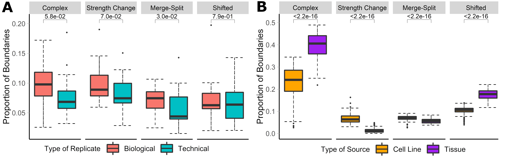]

---
## Distinct biology of differential TAD boundaries

- Non-differential boundaries are most enriched in CTCF and other boundary marks – conserved, biologically important  

- Shifted boundaries are least enriched – shifts are likely due to noisy data

.center[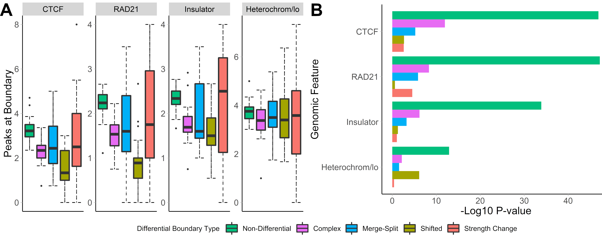]

---
## Dynamics of the 3D genome over time course

.pull-left[ 
- Boundary score allows investigating changes in TAD boundaries over time course   

- Six patterns of boundary changes over time
]

.pull-right[ .center[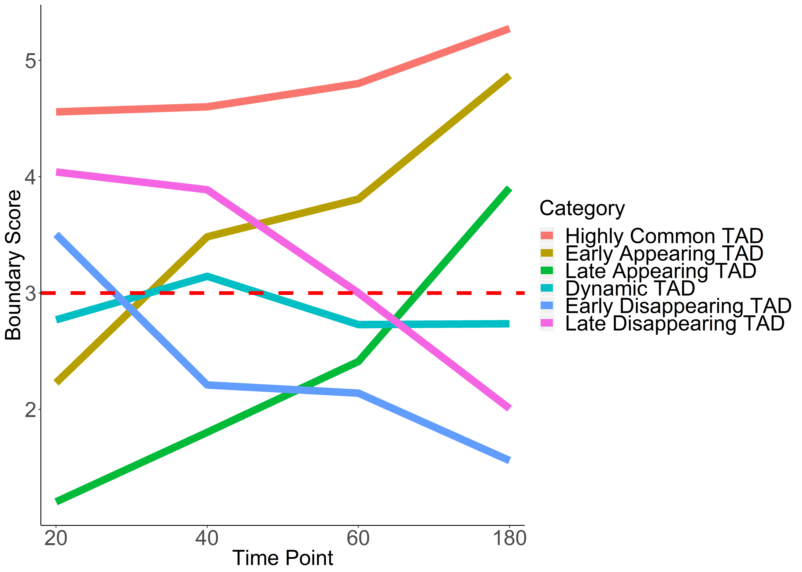] ]

---
## Distinct biology of different patterns of TAD boundary changes

- Auxin treatment experiment - eliminate TAD boundaries with auxin, wash auxin out, observe TAD boundaries recovery

- Early and Late appearing boundaries are most enriched in CTCF, RAD21

.center[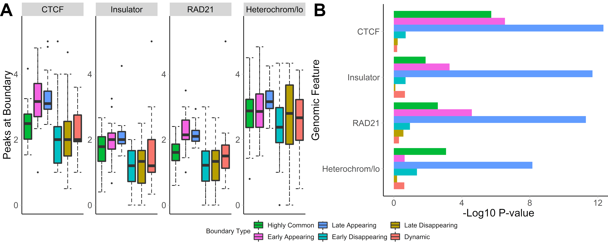]

---
## Time course Hi-C data analysis

- Part of the TADcompare package

- Requires three or more time points

- Can handle replicates at each time point

<br> &nbsp; <br> &nbsp; <br> &nbsp;  

.small[ https://bioconductor.org/packages/TADCompare/

Cresswell, Kellen G., and Mikhail G. Dozmorov. “[TADCompare: An R Package for Differential and Temporal Analysis of Topologically Associated Domains](https://doi.org/10.3389/fgene.2020.00158)” _Frontiers in Genetics_, March 10, 2020 ]

---
class: center, middle

# Understanding the biology of differential chromatin interactions

---
## 3D genome of cancer metastasis and drug resistance

- Patient Derived Xenograft (PDX) mouse models of breast cancer  

- Progression of the primary tumor to metastatic and drug resistant states

.center[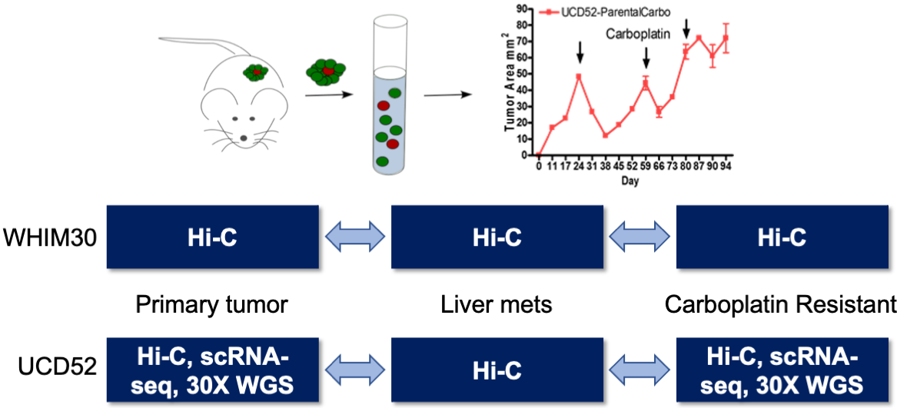]

---
## Analysis of PDX Hi-C data (PDX Hi-C)

.pull-left[ 
- Mouse reads minimally affect Hi-C data - direct alignment to the human genome works well  

- Processing pipeline plays minimal role

- Technology is the most important for data quality
]

.pull-right[ .center[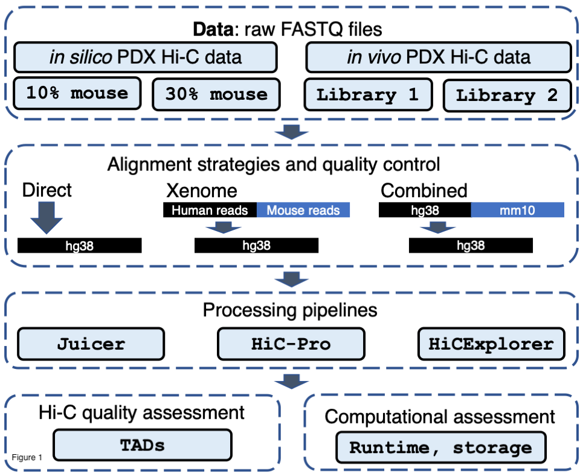] ]

.small[Dozmorov, Mikhail G, Katarzyna M Tyc, Nathan C Sheffield, David C Boyd, Amy L Olex, Jason Reed, and J Chuck Harrell. “[Chromatin Conformation Capture (Hi-C) Sequencing of Patient-Derived Xenografts: Analysis Guidelines](https://doi.org/10.1093/gigascience/giab022)” _GigaScience_ April 21, 2021]

---
## 3D genome of cancer metastasis and drug resistance

.center[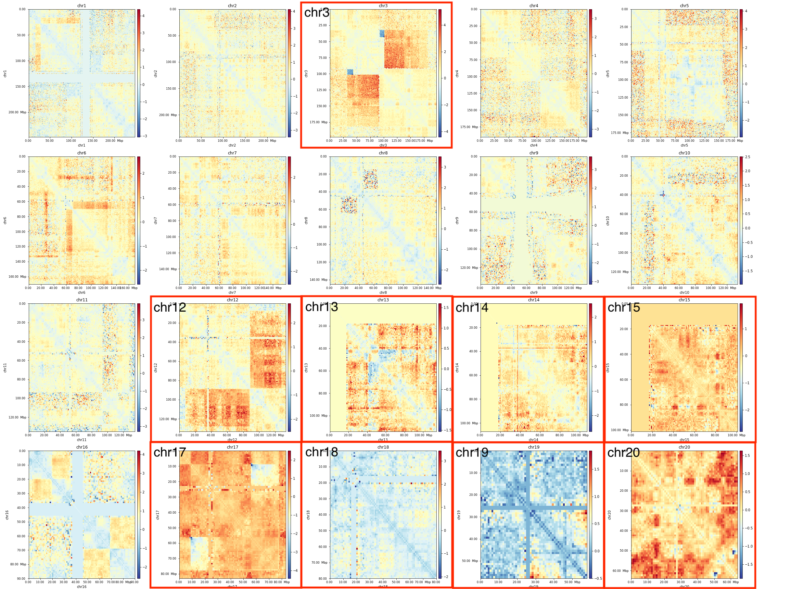]


<!--
## Methods as software

.center[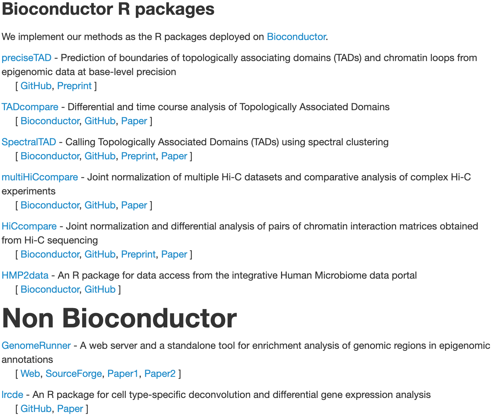]

.small[ https://dozmorovlab.github.io/ ]
-->

---
## Summary

- **Distance-centric view** of Hi-C data is critical (`MD plot`)

- **Joint loess normalization** effectively removes between-dataset biases ([HiCcompare](https://bioconductor.org/packages/HiCcompare/))

- **Differential analysis considering distance** has optimal performance ([multiHiCcompare](https://bioconductor.org/packages/multiHiCcompare/))

- **Spectral clustering** robustly detects biologically relevant hierarchical TADs ([SpectralTAD](https://bioconductor.org/packages/SpectralTAD/))

- **Boundary score** enables differential and time course analysis of TAD boundaries ([TADcompare](https://bioconductor.org/packages/TADCompare/))

<!--
- **Machine learning** using genome annotations detects exact TAD/loop boundary locations ([preciseTAD]())
-->

.small[https://github.com/mdozmorov/HiC_tools]

---
## Acknowledgements

.pull-left[ .center[] 

.small[https://dozmorovlab.github.io/]
]

.pull-rignt[ ### Collaborators  

Virginia Commonwealth University  

- J. Chuck Harrell

<!-- <br> &nbsp; -->

### Funding

- American Cancer Society  
- PhRMA Foundation  
- The George and Lavinia Blick Research Fund

.center[]
]

---
class: center, middle

# Thank you

[bit.ly/3Dgenomics](https://mdozmorov.github.io/Talk_3Dgenome/)

<br> <br> <br>

Bioinformatics postdoc, research assistant positions available

<div class="my-footer">
<a href="https://dozmorovlab.github.io/"> `r icons::fontawesome("id-card", style = "solid")` dozmorovlab.github.io</a> | 
<a href="https://github.com/mdozmorov"> `r icons::fontawesome$brands$github` mdozmorov</a> | 
<a href="https://twitter.com/mikhaildozmorov"> `r icons::fontawesome$brands$twitter` @mikhaildozmorov</a>
</div>

<!--
## Interpretation of differentially interacting chromatin regions (DIRs)

- **Visualization of DIRs.** A Manhattan-like plot of DIRs may inform us about abnormalities or reveal chromosome site-specific enrichment of differentially interacting regions

.center[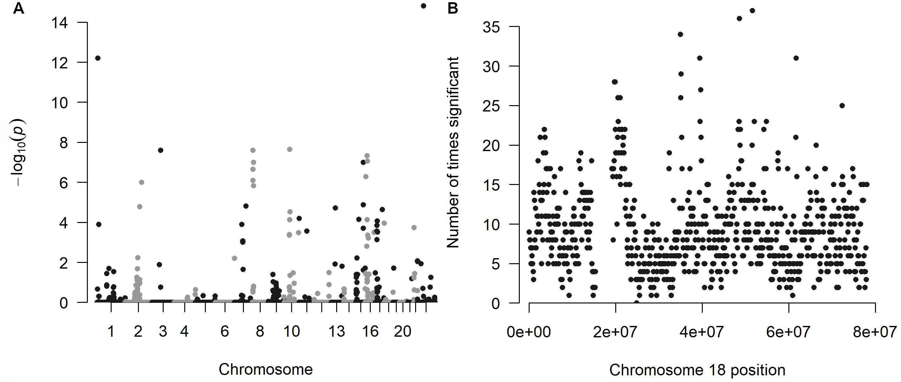]


## Interpretation of differentially interacting chromatin regions (DIRs)

- **Overlap between differentially expressed genes and DIRs.** If gene expression measurements are available, differentially expressed genes may be tested for overlap with DIRs - test the link between DIRs and changed gene expression

- **Functional enrichment of genes overlapping DIRs.** DIRs may disrupt specific pathways/functions - test whether genes overlapping DIRs are enriched in a canonical pathway or share a common function


## Interpretation of differentially interacting chromatin regions (DIRs)

- **Overlap enrichment between TAD boundaries and DIRs.** DIRs may correspond to TAD boundaries that are deleted or created - test DIRs for significant overlap with TAD boundaries detected in either condition or only in boundaries changed between the conditions

- **Overlap between DIRs and transcription factor binding sites.** DIRs may correspond to the locations where proteins bind to DNA, such as CTCF sites - test for enrichment of DIRs in any genome annotation (epigenomic mark)


## Interpretation of differentially interacting regions

.pull-left[ .center[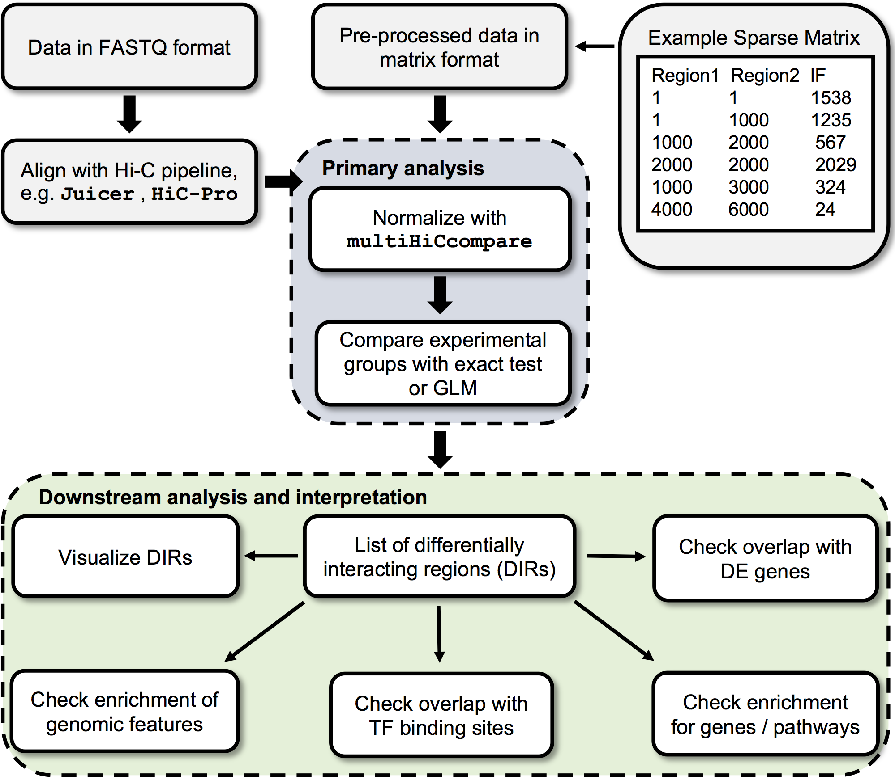] ]

.pull-right[ .center[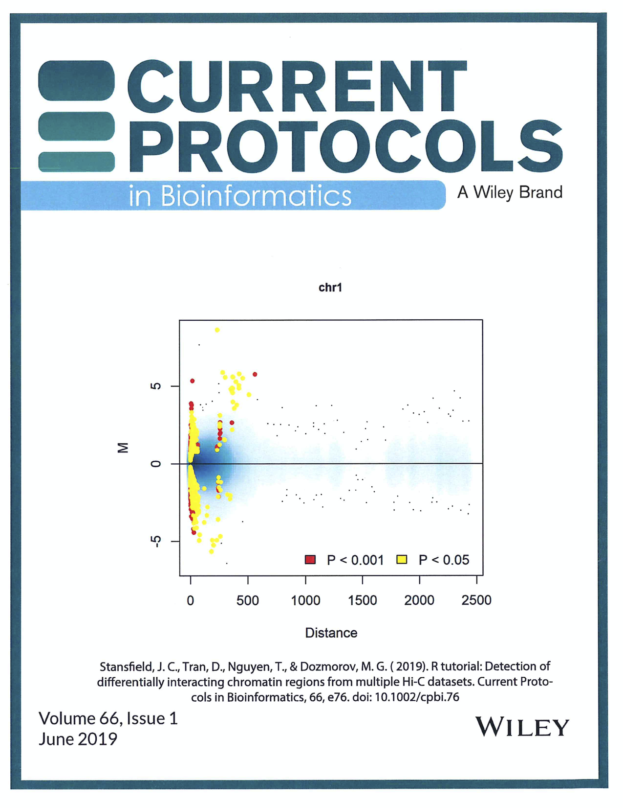] ]

.small[ Stansfield, John C., Duc Tran, Tin Nguyen, and Mikhail G. Dozmorov. “[R Tutorial: Detection of Differentially Interacting Chromatin Regions From Multiple Hi-C Datasets](https://doi.org/10.1002/cpbi.76)” _Curr Prot in Bioinformatics_, May 24, 2019
]

class: center, middle

# preciseTAD


## Machine learning for TAD boundary prediction

.pull-left[ 
- **preciseTAD** – a random forest model using genomic annotations for predicting the probability of each base being a boundary

- Train a model on low-resolution Hi-C regions - binary classification of annotated boundary/non-boundary regions

- Apply the model to each annotated base - predict the likelihood of a base being a boundary

]

.pull-right[ .center[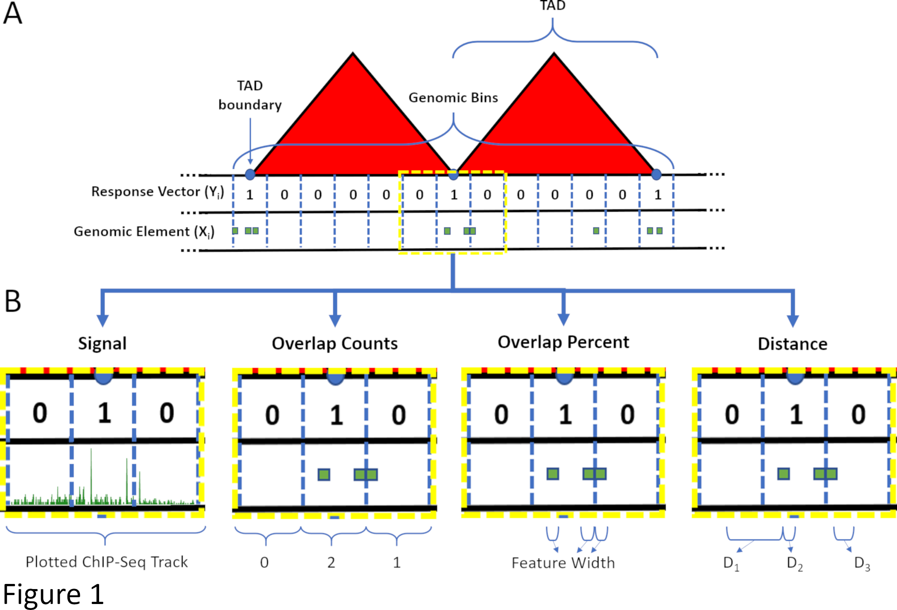] 
]

.small[ Stilianoudakis, Spiro C. “[PreciseTAD: A Machine Learning Framework for Precise 3D Domain Boundary Prediction at Base-Level Resolution](https://doi.org/10.1101/2020.09.03.282186)” _bioRxiv_ Sept 29, 2020]


## Machine learning for TAD boundary prediction

.pull-left[ 

- Different resolutions (5kb)

- Four feature engineering techniques (distance)

- Four approaches to class imbalance (RUS or SMOTE)

- Three types of genome annotations (Transcription factors (CTCF, SMC3, RAD21, ZNF143), Histone modifications, Chromatin states)
]

.pull-right[ .center[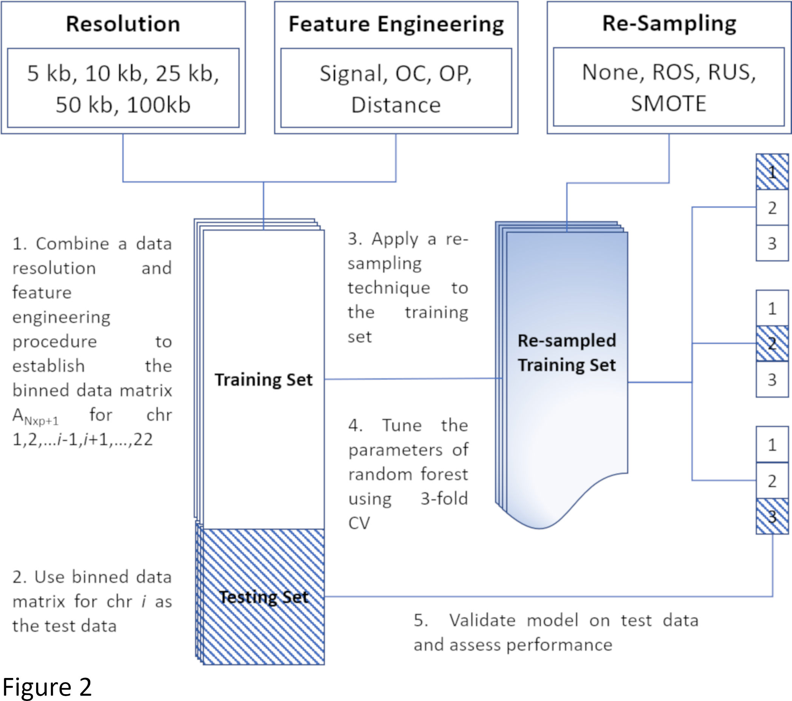] 
]

.small[ Stilianoudakis, Spiro C. “[PreciseTAD: A Machine Learning Framework for Precise 3D Domain Boundary Prediction at Base-Level Resolution](https://doi.org/10.1101/2020.09.03.282186)” _bioRxiv_ Sept 29, 2020]


## Machine learning for TAD boundary prediction

.pull-left[ 
- DBSCAN clustering and PAM to identify boundary regions and summit points  

- Summits are highly enriched in CTCT et al. signal

- Pre-trained models predict boundaries using only genome annotation data 

.small[ Stilianoudakis, Spiro C. “[PreciseTAD: A Machine Learning Framework for Precise 3D Domain Boundary Prediction at Base-Level Resolution](https://doi.org/10.1101/2020.09.03.282186)” _bioRxiv_ Sept 29, 2020]
]

.pull-right[ .center[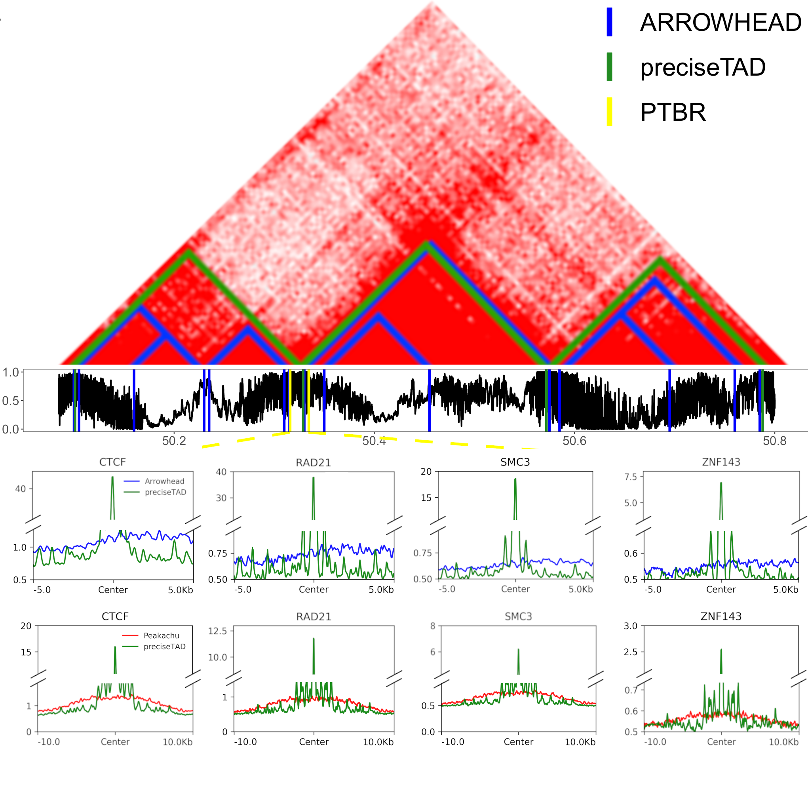] 
]
-->
